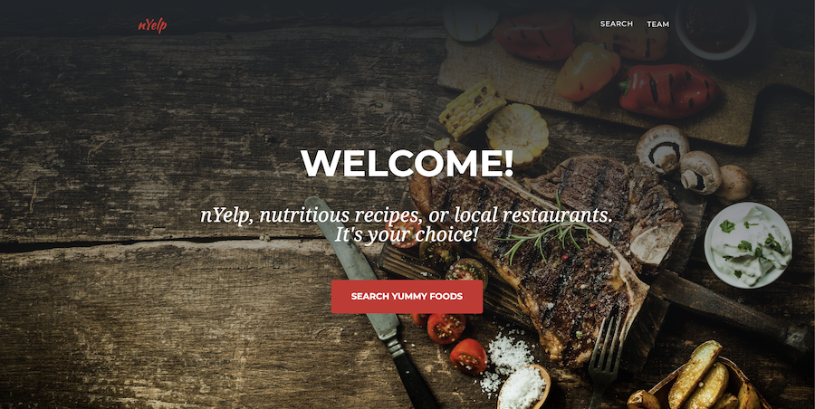

# nYelp

## Description

An application where you can search for the nutritional value for foods and meals and find restaurants on yelp that may server them nearby.

-   Get the most detailed Nutritional value for your meal.
-   See a recipe for your meal.
-   Find a location near you that may serve your craving. (edited)

## Prerequisites

-   [NPM](https://www.npmjs.com/get-npm)
-   [NodeJS](https://nodejs.org/en/)

## Installation

-   `git pull / git merge`
-   `npm install`
-   `npm start` or `gulp watch`

## Author

-   **Pablo Motta** - [github profile](https://github.com/pablomotta)
-   **Cloud Xua** - [github profile](https://github.com/coudx)
-   **Amir Amirvand** - [github profile](https://github.com/Amirvand)

## Live App

[Click here to visit the live website.](https://pablomotta.github.io/nYelp/)

© 2020 Amir Amiravand, Cloud Xu, Pablo Motta
